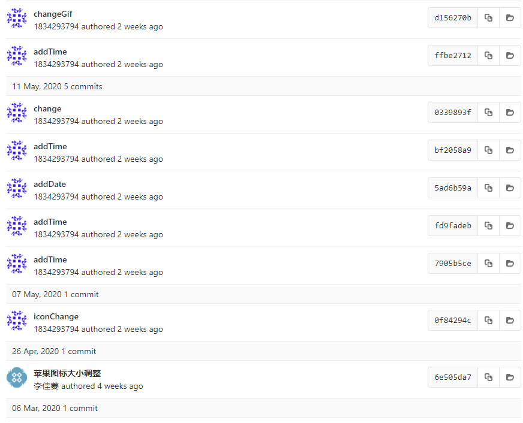
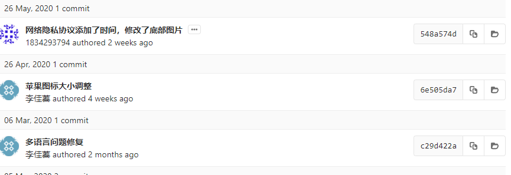

# 2.4 撤销操作

在任何一个阶段，你都有可能想要撤消某些操作

有时候我们提交完了才发现漏掉了几个文件没有添加，或者提交信息写错了。 此时，可以运行带有 --amend 选项的提交命令来重新提交

git commit --amend

这个命令会将暂存区中的文件提交。 如果自上次提交以来你还未做任何修改（例如，在上次提交后马上执行了此命令）， 那么快照会保持不变，而你所修改的只是提交信息。

例如，你提交后发现忘记了暂存某些需要的修改，可以像下面这样操作：

```git
git commit -m 'initial commit'
git add forgotten_file
git commit --amend
```

最终你只会有一个提交——第二次提交将代替第一次提交的结果。从效果上来说，就像是旧有的提交从未存在过一样，它并不会出现在仓库的历史中。
修补提交最明显的价值是可以稍微改进你最后的提交，而不会让“啊，忘了添加一个文件”或者 “小修补，修正笔误”这种提交信息弄乱你的仓库历史

## 取消暂存的文件

 例如，你已经修改了两个文件并且想要将它们作为两次独立的修改提交， 但是却意外地输入 git add * 暂存了它们两个。如何只取消暂存两个中的一个呢？

 使用 git reset HEAD来取消暂存
 通常我们使用git reset HEAD就是回退到当前版本。git reset HEAD^回退到上一版本

 git reset HEAD ，理解就是去除掉添加到暂存区的内容,操作只对暂存区起效果，不对工作区的内容起效果,适用于修改了内容添加到了暂存区，还没有执行commit的情况

 第二种情况：已经commit了，还没有push,push的内容我们先不管，push这个命令其实和提交没关系，他只是推送到远程了，如果push了，也就是我们回退了之后，再重新push一下而已，所以请不要纠结push这个操作。他和提交版本其实没有关系的

 回归话题。我们已经commit了，说明已经生成了最新的版本号了，此时我们想回退，则肯定是回退到之前的一个版本了，如果你知道前一个版本的版本号，git reset 版本号，这样就可以了，但是一般我们不会去记版本号的，当然你可以执行git log命令去查到。git为我们提供了一个更简单的回退上一个版本的方法  git reset HEAD^,此命令专门用于回退到上一个版本，如果你的错误路程已经走的很远了，仅仅回退上一个版本可能也解决不了了，那就需要查找日志，找到对应的版本号进行git reset 版本号进行回退了。我们执行 git reset HEAD^后，再查看状态

## 撤消对文件的修改

如果你并不想保留对 CONTRIBUTING.md 文件的修改怎么办？ 你该如何方便地撤消修改——将它还原成上次提交时的样子（或者刚克隆完的样子，或者刚把它放入工作目录时的样子）

git checkout -- filename

记住，在 Git 中任何 已提交 的东西几乎总是可以恢复的。 甚至那些被删除的分支中的提交或使用 --amend 选项覆盖的提交也可以恢复 （阅读 数据恢复 了解数据恢复）。 然而，任何你未提交的东西丢失后很可能再也找不到了。

## 如何解决Git仓库commit中存在大量无用提交的问题

### 场景

上线构建的过程中观察代码变更，发现，`commit` 提交竟然多达 `62` 次。其中存在多次无用的 `commit` 

### 导致问题

1. 不利于代码 `review`
   设想一下，你要做 `code review` ，结果一个很小的功能，提交了 `60` 多次，会不会有一些崩溃？

2. 会造成分支污染
   你的项目充满了无用的 `commit` 纪录，如果有一天线上出现了紧急问题，你需要回滚代码，却发现海量的 `commit` 需要一条条来看。

### 如何合并多次提交纪录？

需要用到 `git rebase` 了。。

1. 合并最近的 4 次提交纪录，执行：

```
git rebase -i HEAD~4
```

也可以提供某次提交的SHA值，如

```git
 git rebase -i 6e505da73c82be1bebdde23c05fb70f0be8b8ebd
```

之后修改完成后，所有提交会合并到所提供的SHA值对应提交的下一次提交上



2. 这时候，会自动进入 `vi` 编辑模式：

```
s cacc52da add: qrcode
s f072ef48 update: indexeddb hack
s 4e84901a feat: add indexedDB floder
s 8f33126c feat: add test2.js

# Rebase 5f2452b2..8f33126c onto 5f2452b2 (4 commands)
#
# Commands:
# p, pick = use commit
# r, reword = use commit, but edit the commit message
# e, edit = use commit, but stop for amending
# s, squash = use commit, but meld into previous commit
# f, fixup = like "squash", but discard this commit's log message
# x, exec = run command (the rest of the line) using shell
# d, drop = remove commit
#
# These lines can be re-ordered; they are executed from top to bottom.
#
# If you remove a line here THAT COMMIT WILL BE LOST.
#
# However, if you remove everything, the rebase will be aborted.
#
```


有几个命令需要注意一下：

- p, pick = use commit
- r, reword = use commit, but edit the commit message
- e, edit = use commit, but stop for amending
- s, squash = use commit, but meld into previous commit
- f, fixup = like “squash”, but discard this commit’s log message
- x, exec = run command (the rest of the line) using shell
- d, drop = remove commit

**可以将这些提交的最后一次改成r,将前面的无用提交改成s，之后保存退出vi编辑器**

3. 如果保存的时候，你碰到了这个错误：

```
error: cannot 'squash' without a previous commit
```

注意不要合并先前提交的东西，也就是已经提交远程分支的纪录。

4. 如果你异常退出了 `vi` 窗口，不要紧张：

```
git rebase --edit-todo
```

这时候会一直处在这个编辑的模式里，我们可以回去继续编辑，修改完保存一下：

```
git rebase --continue
```

5. 执行git push，提交历史会变成

   6.

6. 当然如果直接git push很可能被拒绝，可以创建一个新分支如ye-dev，再提交上去这个新分支，

   ```git
   git push --set-upstream origin ye-dev
   ```

   之后远程仓库上申请将该分支合并到master上