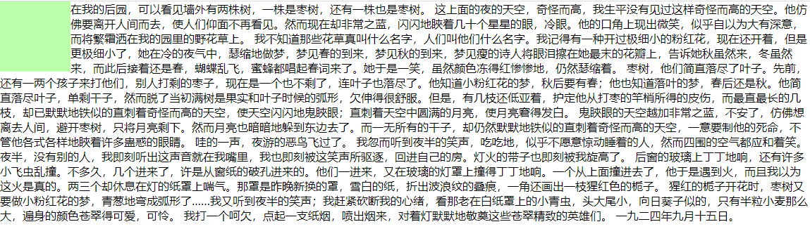
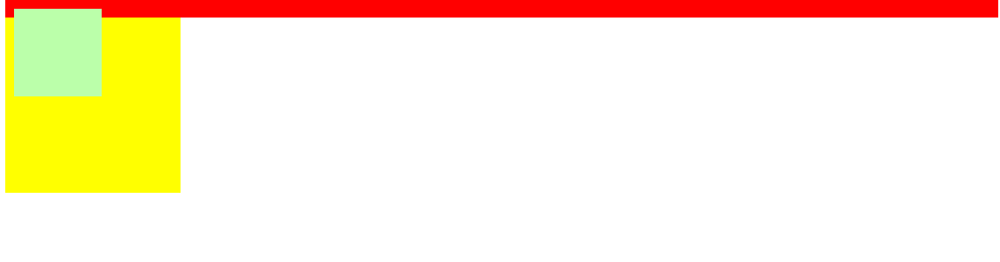

# CSS浮动

## 浮动简介

通过浮动可以使一个元素向其父元素的左侧或右侧移动

使用 float 属性来设置于元素的浮动

可选值：

- none 默认值 ，元素不浮动
- left 元素向左浮动
- right 元素向右浮动

 注意，元素设置浮动以后，水平布局的等式便不需要强制成立

​          比如，原理width设置200，父元素宽度是700，为了满足等式，右外边距会自动变为500

​          设置浮动后width设置200，即使父元素是700，右外边距还是为0，不会自动去满足等式了

元素设置浮动以后，会完全从文档流中脱离，不再占用文档流的位置，所以元素下边的还在文档流中的元素会自动向上移动

## 浮动的特点：

1. 浮动元素会完全脱离文档流，不再占据文档流中的位置

2. 设置浮动以后元素会向父元素的左侧或右侧移动，

3. 浮动元素默认不会从父元素中移出

4. 浮动元素向左或向右移动时，不会超过它前边的其他浮动元素

5. 如果浮动元素的上边是一个没有浮动的块元素，则浮动元素无法上移

6. 浮动元素不会超过它上边的浮动的兄弟元素，最多最多就是和它一样高

   - 比如父元素宽700，第一行有一个向左浮动的400宽的元素，

   - 第二行有一个向左浮动的400宽元素（因为第一行放不下，所以在第二行）

   - 第二行还有一个向右浮动的200宽的元素（即使第一行放得下它，但它上边的兄弟因素在第二行，它也只能在第二行）

 **简单总结：**浮动目前来讲它的主要作用就是让页面中的元素可以水平排列，通过浮动可以制作一些水平方向的布局  

### 例子

```html
<!DOCTYPE html>
<html lang="en">
<head>
    <meta charset="UTF-8">
    <meta name="viewport" content="width=device-width, initial-scale=1.0">
    <meta http-equiv="X-UA-Compatible" content="ie=edge">
    <title>Document</title>
    <style>
        .box1{
            width: 400px;
            height: 200px;
            background-color: #bfa;
            float: left;
        }

        .box2{
            width: 400px;
            height: 200px;
            background-color: orange;
            float: left;
        }

        .box3{
            width: 200px;
            height: 200px;
            background-color: yellow;
            float: right;
        }
    </style>
</head>
<body>
    <div class="box1"></div>
    <div class="box2"></div>
    <div class="box3"></div>   
</body>
</html>
```


## 浮动的其他特点：

**浮动元素不会盖住文字，文字会自动环绕在浮动元素的周围，所以我们可以利用浮动来设置文字环绕图片的效果**

```html
<!DOCTYPE html>
<html lang="en">
<head>
    <meta charset="UTF-8">
    <meta name="viewport" content="width=device-width, initial-scale=1.0">
    <meta http-equiv="X-UA-Compatible" content="ie=edge">
    <title>Document</title>
    <style>
        *{
            margin: 0;
            padding: 0;
        }
        .box1{
            width: 100px;
            height: 100px;
            background-color: #bfa;
            float: left;
        }
    </style>
</head>
<body>
    <div class="box1"></div>
    <p>
        在我的后园，可以看见墙外有两株树，一株是枣树，还有一株也是枣树。 这上面的夜的天空，奇怪而高，我生平没有见过这样奇怪而高的天空。他仿佛要离开人间而去，使人们仰面不再看见。然而现在却非常之蓝，闪闪地䀹着几十个星星的眼，冷眼。他的口角上现出微笑，似乎自以为大有深意，而将繁霜洒在我的园里的野花草上。 我不知道那些花草真叫什么名字，人们叫他们什么名字。我记得有一种开过极细小的粉红花，现在还开着，但是更极细小了，她在冷的夜气中，瑟缩地做梦，梦见春的到来，梦见秋的到来，梦见瘦的诗人将眼泪擦在她最末的花瓣上，告诉她秋虽然来，冬虽然来，而此后接着还是春，蝴蝶乱飞，蜜蜂都唱起春词来了。她于是一笑，虽然颜色冻得红惨惨地，仍然瑟缩着。 枣树，他们简直落尽了叶子。先前，还有一两个孩子来打他们，别人打剩的枣子，现在是一个也不剩了，连叶子也落尽了。他知道小粉红花的梦，秋后要有春；他也知道落叶的梦，春后还是秋。他简直落尽叶子，单剩干子，然而脱了当初满树是果实和叶子时候的弧形，欠伸得很舒服。但是，有几枝还低亚着，护定他从打枣的竿梢所得的皮伤，而最直最长的几枝，却已默默地铁似的直刺着奇怪而高的天空，使天空闪闪地鬼䀹眼；直刺着天空中圆满的月亮，使月亮窘得发白。 鬼䀹眼的天空越加非常之蓝，不安了，仿佛想离去人间，避开枣树，只将月亮剩下。然而月亮也暗暗地躲到东边去了。而一无所有的干子，却仍然默默地铁似的直刺着奇怪而高的天空，一意要制他的死命，不管他各式各样地䀹着许多蛊惑的眼睛。 哇的一声，夜游的恶鸟飞过了。 我忽而听到夜半的笑声，吃吃地，似乎不愿意惊动睡着的人，然而四围的空气都应和着笑。夜半，没有别的人，我即刻听出这声音就在我嘴里，我也即刻被这笑声所驱逐，回进自己的房。灯火的带子也即刻被我旋高了。 后窗的玻璃上丁丁地响，还有许多小飞虫乱撞。不多久，几个进来了，许是从窗纸的破孔进来的。他们一进来，又在玻璃的灯罩上撞得丁丁地响。一个从上面撞进去了，他于是遇到火，而且我以为这火是真的。两三个却休息在灯的纸罩上喘气。那罩是昨晚新换的罩，雪白的纸，折出波浪纹的叠痕，一角还画出一枝猩红色的栀子。 猩红的栀子开花时，枣树又要做小粉红花的梦，青葱地弯成弧形了……我又听到夜半的笑声；我赶紧砍断我的心绪，看那老在白纸罩上的小青虫，头大尾小，向日葵子似的，只有半粒小麦那么大，遍身的颜色苍翠得可爱，可怜。 我打一个呵欠，点起一支纸烟，喷出烟来，对着灯默默地敬奠这些苍翠精致的英雄们。 一九二四年九月十五日。
    </p>
</body>
</html>
```



**元素设置浮动以后，将会从文档流中脱离，从文档流中脱离后，元素的一些特点也会发生变化**

脱离文档流的特点：

块元素：

1. 块元素不在独占页面的一行

2. 脱离文档流以后，块元素的宽度和高度默认都被内容撑开

行内元素：

行内元素脱离文档流以后会变成块元素，特点和块元素一样

1. 块元素不在独占页面的一行

2. 脱离文档流以后，块元素的宽度和高度默认都被内容撑开

脱离文档流以后，不需要再区分块和行内了

## 高度塌陷

**高度塌陷的问题:**

在浮动布局中，父元素的高度默认是被子元素撑开的，当子元素浮动后，其会完全脱离文档流，子元素从文档流中脱离，将会无法撑起父元素的高度，导致父元素的高度丢失，父元素高度丢失以后，其下的元素会自动上移，导致页面的布局混乱。

所以高度塌陷是浮动布局中比较常见的一个问题，这个问题我们必须要进行处理！

### 例子

子元素未浮动：

```html
<!DOCTYPE html>
<html lang="en">
<head>
    <meta charset="UTF-8">
    <meta name="viewport" content="width=device-width, initial-scale=1.0">
    <meta http-equiv="X-UA-Compatible" content="ie=edge">
    <title>Document</title>
    <style>
        .outer{
            border: 10px red solid;
        }
        .inner{
            width: 100px;
            height: 100px;
            background-color: #bfa;
    </style>
</head>
<body>
    <div class="outer">
        <div class="inner"></div>
    </div>
    <div style="width: 200px;height: 200px;background-color:yellow;"></div>
</body>
</html>
```


子元素设置浮动

```html
<!DOCTYPE html>
<html lang="en">
<head>
    <meta charset="UTF-8">
    <meta name="viewport" content="width=device-width, initial-scale=1.0">
    <meta http-equiv="X-UA-Compatible" content="ie=edge">
    <title>Document</title>
    <style>
        .outer{
            border: 10px red solid;
        }
        .inner{
            width: 100px;
            height: 100px;
            background-color: #bfa;
            float:left;
    </style>
</head>
<body>
    <div class="outer">
        <div class="inner"></div>
    </div>
    <div style="width: 200px;height: 200px;background-color:yellow;"></div>
</body>
</html>
```



## 如何解决高度塌陷的问题

### 一·：BFC

 **BFC(Block Formatting Context) 块级格式化环境**

​          \- BFC是一个CSS中的一个隐含的属性，可以为一个元素开启BFC

​            开启BFC该元素会变成一个独立的布局区域

​          \- 元素开启BFC后的特点：

​            1.开启BFC的元素不会被浮动元素所覆盖

​            2.开启BFC的元素子元素和父元素外边距不会重叠

​            3.开启BFC的元素可以包含浮动的子元素(重要)，父元素高度会随着浮动子元素高度的变化而变化


​          \- 可以通过一些特殊方式来开启元素的BFC：

​            1、设置元素的浮动（不推荐）

​            2、将元素设置为行内块元素（不推荐）

​            3、将元素的overflow设置为一个非visible的值

​              \- 常用的方式 为元素设置 `overflow:hidden` 开启其BFC 以使其可以包含浮动元素

```html
<!DOCTYPE html>
<html lang="en">
<head>
    <meta charset="UTF-8">
    <meta name="viewport" content="width=device-width, initial-scale=1.0">
    <meta http-equiv="X-UA-Compatible" content="ie=edge">
    <title>Document</title>
    <style>
        .outer{
            border: 10px red solid;
             /* float: left; */
             /* display: inline-block; */
            overflow:hidden;
        }
        .inner{
            width: 100px;
            height: 100px;
            background-color: #bfa;
            float:left;
    </style>
</head>
<body>
    <div class="outer">
        <div class="inner"></div>
    </div>
    <div style="width: 200px;height: 200px;background-color:yellow;"></div>
</body>
</html>
```

设置`display: inline-block`的情况


设置 `overflow:hidden`的情况


### 二：clear

```html
<!DOCTYPE html>
<html lang="en">
<head>
    <meta charset="UTF-8">
    <meta name="viewport" content="width=device-width, initial-scale=1.0">
    <meta http-equiv="X-UA-Compatible" content="ie=edge">
    <title>Document</title>
    <style>

        div{
            font-size: 50px;
        }

        .box1{
            width: 200px;
            height: 200px;
            background-color: #bfa;
            float: left;
        }

        .box2{
            width: 400px;
            height: 400px;
            background-color: #ff0;
            float: right;
        }

        .box3{
            width: 200px;
            height: 200px;
            background-color: orange;
        }
    </style>
</head>
<body>
    <div class="box1">1</div>
    <div class="box2">2</div>
    <div class="box3">3</div> 
</body>
</html>
```


由于box1的浮动，导致box3位置上移，box3被box1覆盖， 也就是box3收到了box1浮动的影响，位置发生了改变

如果我们不希望某个元素因为其他元素浮动的影响而改变位置，可以通过clear属性来清除浮动元素对当前元素所产生的影响

 clear

- 作用：清除浮动元素对当前元素所产生的影响

- 可选值：

  - left 清除左侧浮动元素对当前元素的影响

  - right 清除右侧浮动元素对当前元素的影响

  - both 清除两侧中最大影响的那侧

- 原理：设置清除浮动以后，浏览器会自动为元素添加一个上外边距，以使其位置不受其他元素的影响

设置`clear:both`后

```html
<!DOCTYPE html>
<html lang="en">
<head>
    <meta charset="UTF-8">
    <meta name="viewport" content="width=device-width, initial-scale=1.0">
    <meta http-equiv="X-UA-Compatible" content="ie=edge">
    <title>Document</title>
    <style>

        div{
            font-size: 50px;
        }

        .box1{
            width: 200px;
            height: 200px;
            background-color: #bfa;
            float: left;
        }

        .box2{
            width: 400px;
            height: 400px;
            background-color: #ff0;
            float: right;
        }

        .box3{
            width: 200px;
            height: 200px;
            background-color: orange;
             clear: both;
        }
    </style>
</head>
<body>
    <div class="box1">1</div>
    <div class="box2">2</div>
    <div class="box3">3</div>    
</body>
</html>
```


### 三：父元素结束标签之前插入清除浮动的块级元素

```html
<!DOCTYPE html>
<html lang="en">
<head>
    <meta charset="UTF-8">
    <meta name="viewport" content="width=device-width, initial-scale=1.0">
    <meta http-equiv="X-UA-Compatible" content="ie=edge">
    <title>Document</title>
    <style>
        .box1{
            border: 10px red solid;
        }
	
        .box2{
            width: 100px;
            height: 100px;
            background-color: #bfa;
            float: left;
        }

        .box3 {
            clear:both;
        }
        
    </style>
</head>
<body>
    <div class="box1">
        <div class="box2"></div>
        <div class="box3"></div>
    </div>
</body>
</html>
```

### 四：高度塌陷的最终解决方案，利用伪元素

```html
<!DOCTYPE html>
<html lang="en">
<head>
    <meta charset="UTF-8">
    <meta name="viewport" content="width=device-width, initial-scale=1.0">
    <meta http-equiv="X-UA-Compatible" content="ie=edge">
    <title>Document</title>
    <style>
        .box1{
            border: 10px red solid;
        }

        .box2{
            width: 100px;
            height: 100px;
            background-color: #bfa;
            float: left;
        }

        /* after默认是一个行内元素 */
        .box1::after{
            content: '';
            display: block;
            clear: both;
        }
        
    </style>
</head>
<body>
    <div class="box1">
        <div class="box2"></div>
    </div>
</body>
</html>
```


这相当于是前一种清除浮动方法（添加空白div）的另一种变形，其底层逻辑也是完全一样的

## clearfix

```html
<!DOCTYPE html>
<html lang="en">
<head>
    <meta charset="UTF-8">
    <meta name="viewport" content="width=device-width, initial-scale=1.0">
    <meta http-equiv="X-UA-Compatible" content="ie=edge">
    <title>Document</title>
    <style>
        .box1{
            width: 200px;
            height: 200px;
            background-color: #bfa;
        }

        /* 使用block无法隔开父子外边距，而inline-block也会是外边距多出一截，因为inline-block伪元素也会占据一定位置 
        而使用table不仅能隔开父子外边距，它本身还是空的，不会占位置*/
        /* .box1::before{
            content: '';
            display: table;
        } */

        .box2{
            width: 100px;
            height: 100px;
            background-color: orange;
            margin-top: 100px;
        }
/* clearfix 这个样式可以同时解决高度塌陷和外边距重叠的问题，当你在遇到这些问题时，直接使用clearfix这个类即可 */
/* 它相当于
        (解决外边距重叠)
        .box1::before{
            content: '';
            display: table;
        } 
        和
        (解决高度塌陷)
        .box1::after{
            content: '';
            display: block;
            clear: both;
        }
        的结合体                                */
        .clearfix::before,
        .clearfix::after{
            content: '';
            display: table;
            clear: both;
        }
    </style>
</head>
<body>
    <div class="box1 clearfix">
        <div class="box2"></div>
    </div>    
</body>
</html>
```

