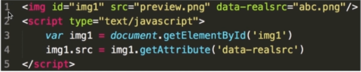

# JS前端性能优化

## 一、JS中的前端性能优化原则：

- 多使用内存、缓存等方法
- 减少CPU计算、减少网络请求

------

针对上述两项原则，我们可以从两个方向入手来进行前端的性能优化。

## 加载资源优化

### 1. **静态资源的压缩合并**


从上图可以看出不合并请求有以下缺点：

- 文件与文件之间有插入的上行请求，增加了N-1个网络延迟
- 受丢包问题影响更严重
- keep-alive方式可能会出现状况，经过代理服务器时可能会被断开，也就是说不能一直保持keep-alive的状态

**压缩合并css和js可以减少网站http请求的次数，但合并文件可能会带来问题:首屏渲染和缓存失效问题**。那该如何处理这问题呢？----公共库合并和不同页面的合并。


我们可以利用webpack等打包工具进行资源的合并与压缩操作，可以大大减小资源的大小，实现页面更快的加载。


### **2.静态资源缓存**

当浏览器发送请求时，可以检测该资源的最新版本是否存在于本地，若存在，则不进行重新加载。


### **3.使用CDN让资源加载更快**

CDN可以对不同区域的网络进行优化。例如用BootCDN进行优化的事例：


浏览器缓存始终只是为了提升二次访问的速度，对于首次访问的加速，我们需要从网络层面进行优化，最常见的手段就是CDN（Content Delivery Network，内容分发网络）加速。**通过将静态资源(例如javascript，css，图片等等）缓存到离用户很近的相同网络运营商的CDN节点上，不但能提升用户的访问速度，还能节省服务器的带宽消耗，降低负载。**


#### CDN是怎么做到加速的呢？

其实这是CDN服务商在全国各个省份部署计算节点，CDN加速将网站的内容缓存在网络边缘,不同地区的用户就会访问到离自己最近的相同网络线路上的CDN节点，当请求达到CDN节点后，节点会判断自己的内容缓存是否有效，如果有效，则立即响应缓存内容给用户，从而加快响应速度。如果CDN节点的缓存失效，它会根据服务配置去我们的内容源服务器获取最新的资源响应给用户，并将内容缓存下来以便响应给后续访问的用户。**因此，一个地区内只要有一个用户先加载资源，在CDN中建立了缓存，该地区的其他后续用户都能因此而受益**。


### 4.预解析DNS

**资源预加载是另一个性能优化技术，我们可以使用该技术来预先告知浏览器某些资源可能在将来会被使用到。** 通过 DNS 预解析来告诉浏览器未来我们可能从某个特定的 URL 获取资源，当浏览器真正使用到该域中的某个资源时就可以尽快地完成 DNS 解析。例如，我们将来可从 example.com 获取图片或音频资源，那么可以在文档顶部的  标签中加入以下内容：

```
<link rel="dns-prefetch" href="//example.com">
```

当我们从该 URL 请求一个资源时，就不再需要等待 DNS 的解析过程。该技术对使用第三方资源特别有用。通过简单的一行代码就可以告知那些兼容的浏览器进行 DNS 预解析，这意味着当浏览器真正请求该域中的某个资源时，DNS 的解析就已经完成了,从而节省了宝贵的时间。 另外需要注意的是，**浏览器会对a标签的href自动启用DNS Prefetching，所以a标签里包含的域名不需要在head中手动设置link。但是在HTTPS下不起作用，需要meta来强制开启功能**。这个限制的原因是防止窃听者根据DNS Prefetching推断显示在HTTPS页面中超链接的主机名。下面这句话作用是强制打开a标签域名解析

```
<meta http-equiv="x-dns-prefetch-control" content="on">
```


## 2、渲染优化

### 5.非核心代码异步加载

**异步加载的三种方式——async和defer、动态脚本创建**

**① async方式**

- async属性是HTML5新增属性，需要Chrome、FireFox、IE9+浏览器支持
- async属性规定一旦脚本可用，则会异步执行
- async属性仅适用于外部脚本
- 如果是多个脚本，该方法不能保证脚本按顺序执行

```
<script type="text/javascript" src="xxx.js" async="async"></script>
复制代码
```

**② defer方式**

- 兼容所有浏览器
- defer属性规定是否对脚本执行进行延迟，直到页面加载为止
- 如果是多个脚本，该方法可以确保所有设置了defer属性的脚本按顺序执行
- 如果脚本不会改变文档的内容，可将defer属性加入到script标签中，以便加快处理文档的速度

**③动态创建script标签** 在还没定义defer和async前，异步加载的方式是动态创建script，通过window.onload方法确保页面加载完毕再将script标签插入到DOM中,具体代码如下：

```
function addScriptTag(src){  
    var script = document.createElement('script');  
    script.setAttribute("type","text/javascript");  
    script.src = src;  
    document.body.appendChild(script);  
}  
window.onload = function(){  
    addScriptTag("js/index.js");  
}  
复制代码
```

#### 2、异步加载的区别

**1)defer是在HTML解析完之后才会执行，如果是多个，按照加载的顺序依次执行**

**2)async是在加载完之后立即执行，如果是多个，执行顺序和加载顺序无关**


其中蓝色线代表网络读取，红色线代表执行时间，这俩都是针对脚本的；绿色线代表 HTML 解析。


### **6.CSS放到header中，JS放到body最下面**

（1）将CSS放在<header></header>部分：在渲染body部分时，可以渲染已经规定好样式。若将CSS样式放到要渲染的DOM节点之后，就会出现最开始按照默认形式渲染，执行到css样式又重新渲染。造成样式跳转：用户体验差；性能差：需渲染两次。
正确使用方式如下：


若将6行放到9后面，就会出现重复加载现象。

（2）JS会阻塞页面DOM的加载，若将JS放到body最下面，`首先`不会阻塞页面渲染，可以将页面全部渲染后再执行js。`其次`可以拿到所有的标签，如果放在html上面可能拿不到标签，因为还没有被渲染到。
错误事例：加载执行9行，阻塞第10行的执行。


`注意`以该方式进行异步加载时不会阻塞页面的渲染，因为img标签已经渲染出来，只是请求的异步加载内容在加载。


### **7.图片的懒加载**

所谓懒加载，就是当用户下拉到该页面时再加载图片，而不是当用户打开页面就将所有图片全部加载完毕。



在页面渲染时，将src传入一个很小的图片，真正的图片地址放在自定义属性data-lealsrc中，当真正执行时，再将所需图片加载进来。


### **8.减少DOM查询，对DOM查询做缓存**

DOM操作是一种非常耗费性能的操作，在写程序时要尽量减少DOM操作。


通过上面的两种实现方式对比可以看出：未缓存DOM查询时，每次循环都要进行DOM查询；缓存了DOM查询时，只需进行一次DOM查询操作，将数值保存在变量中使用即可。


### **9.合并DOM操作**


向文档中插入10个li标签，原始操作是有十次DOM插入操作，但是我们利用定义一个片段（frag），向片段中插入li，不会触发DOM操作，最后将该片段插入到DOM中。只许一次DOM操作，大大提高性能。


### **10.时间节流**


这个代码实现的功能是：当连续很快输入时，不需要每次抬起按键都执行函数，只有当按键抬起超过100ms才执行操作，可以减少事件操作，因为在连续操作时会执行很多计算，严重影响性能。


### **11.用DOMContentLoaded替代window.onload**

window.onload:在页面加载完毕才会执行操作。
DOMContentLoaded：在页面渲染完执行操作，此时图片、视频等可能还未被加载完。


图片、视频等静态资源大小参差不齐，加载完成时间又会有很大的差别，但html一般很小，加载时间很短，所以利用DOMContentLoaded可以显著提高性能和用户体验。


### 12.减少通过JavaScript代码修改元素样式，尽量使用修改class名方式操作样式或动画

