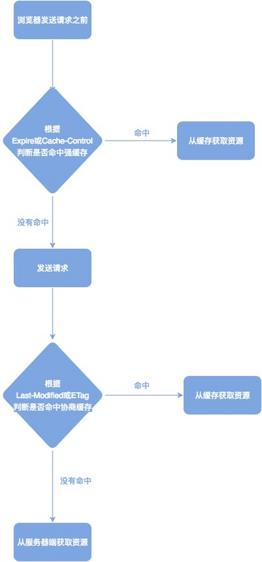
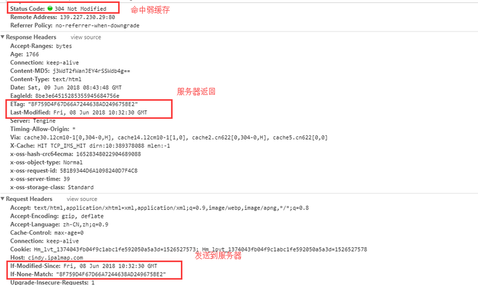

# 浏览器的强缓存和弱缓存

每个人都知道进入一次网页之后再刷新一次页面，加载速度会比首次加载快非常多，每个人都知道这是浏览器缓存的magic，但是对此背后的原因可能不甚了解。

浏览器对静态资源的HTTP缓存有两种情况，一种是强缓存(本地缓存)，另一种是弱缓存(协商缓存)

## 缓存流程

浏览器第一次请求资源时：


浏览器第一次请求资源时，必须下载所有的资源，然后根据响应的header内容来决定，如何缓存资源。可能采用的是强缓存，也可能是弱缓存

浏览器后续请求资源时的匹配流程：



- 由上图可以知道当浏览器请求一个静态资源时的HTTP流程：
  - 强缓存阶段：先在本地查找该资源，如果发现该资源，并且其他限制也没有问题(比如:缓存有效时间)，就命中强缓存，返回200，直接使用强缓存，并且不会发送请求到服务器
  - 弱缓存阶段：在本地缓存中找到该资源，发送一个http请求到服务器，服务器判断这个资源没有被改动过，则返回304，让浏览器使用该资源。
  - 缓存失败阶段(重新请求)：当服务器发现该资源被修改过，或者在本地没有找到该缓存资源，服务器则返回该资源的数据。

## 强缓存与弱缓存的区别

获取资源形式： 都是从缓存中获取资源的。

状态码： 强缓存返回200(from cache),弱缓存返回304状态码

请求(最大区别)：

强缓存不发送请求，直接从缓存中取。

弱缓存需要发送一个请求，验证这个文件是否可以使用（有没有被改动过）。

## 强缓存

强缓存是利用Expires或者Cache-Control，让原始服务器为文件设置一个过期时间，在多长时间内可以将这些内容视为最新的。若时间未过期，则命中强缓存，使用缓存文件不发送请求。

### http1.0时代的缓存 Expires+Pragma

**Expires**用于设置缓存到期时间：指定缓存到期GMT的绝对时间，如果设了max-age，max-age就会覆盖expires，如果expires到期需要重新请求。有一个问题是由于使用具体时间，如果时间表示出错或者没有转换到正确的时区都可能造成缓存生命周期出错。

**Pragma禁用缓存：**

`Pragma : no-cache` 表示防止客户端缓存，需要强制从服务器获取最新的数据；

```
Pragma : no-cache //只有这一个用法 禁用缓存，强制从服务器获取最新的数据；
```

### http1.1

**Cache-Control** 是http1.1中为了弥补Expires的缺陷而加入的，当Expires和Cache-Control同时存在时，Cache-Control优先级高于Expires。

### 强缓存命中 from memory cache & from disk cache

命中强缓存时，有两种状态，200 (from memory cache) cache & 200 (from disk cache)，两者的区别：

memory cache: 将资源存到内存中，从内存中获取。

disk cache：将资源缓存到磁盘中，从磁盘中获取。

二者最大的区别在于：当退出进程时，内存中的数据会被清空，而磁盘的数据不会。

## 弱缓存

如果强缓存时间过期，或者没有设置，导致未命中的话。就进入到了弱缓存的阶段了，

### Last-Modified & if-modified-since

Last-Modified与If-Modified-Since是一对报文头，属于http 1.0。

last-modified是web服务器认为文件的最后修改时间，last-modified是第一次请求文件的时候，服务器返回的一个属性。

```html
Last-Modified: Sat, 09 Jun 2018 08:13:56 GMT
```

第二次请求这个文件时，浏览器把If-Modified-Since发送给服务器，询问该时间之后文件是否被修改过。

```html
If-Modified-Since: Sat, 09 Jun 2018 08:13:56 GMT // 跟Last-Modified的值一样
```

### ETag & If-None-Match

ETag与If-None-Match是一对报文，属于http 1.1。

ETag是一个文件的唯一标志符。就像一个哈希或者指纹，每个文件都有一个单独的标志，只要这个文件发生了改变，这个标志就会发生变化。

ETag机制类似于乐观锁机制，如果请求报文的ETag与服务器的不一致，则表示该资源已经被修改过来，需要发最新的内容给浏览器。

ETag也是首次请求的时候，服务器返回的:

```html
ETag: "8F759D4F67D66A7244638AD249675BE2" // 长这样
```

If-None-Match也是浏览器发送到服务器验证，文件是否改变的:

```html
If-None-Match: "8F759D4F67D66A7244638AD249675BE2" // 跟ETag的值一样
```

### ETag/lastModified过程如下

1. 客户端第一次向服务器发起请求,服务器将附加Last-Modified/ETag到所提供的资源上去
2. 当再一次请求资源,如果没有命中强缓存,在执行在验证时,将上次请求时服务器返回的Last-Modified/ETag一起传递给服务器。
3. 服务器检查该Last-Modified或ETag，并判断出该资源页面自上次客户端请求之后还未被修改，返回响应304和一个空的响应体。

### 同时使用两个报文头

同时使用这两个报文头，两个都匹配才会命中弱缓存，否则将重新请求资源。



### ETag 主要为了解决 Last-Modified 存在的而又无法解决的一些问题

1. 一些文件也许内容并不改变(仅仅改变的修改时间)，这个时候我们不希望文件重新加载。（ETag值会触发缓存，Last-Modified不会触发）
2. If-Modified-Since能检查到的粒度是秒级的，某些文件修改非常频繁,比如在秒以下的时间内进行修改(比如1s内修改了N次)，这种修改是无法判断的
3. 某些服务器不能精确得到文件的最后修改时间， 这样就无法通过最后修改时间来判断文件是否更新了。
