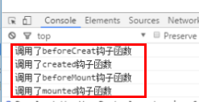

# 详解Vue生命周期

## Vue实例的生命周期全过程（图）


 

**（这里的红边圆角矩形内的都是对应的Vue实例的钩子函数）**

## 在beforeCreate和created钩子函数间的生命周期


 

在beforeCreate和created之间，进行数据观测(data observer) ，也就是在这个时候开始监控data中的数据变化了，同时初始化事件

可以看到在created的时候数据已经和data属性进行绑定,但是页面中的插值表达式还没有被替换。
注意：此时还是没有创建$el


## created钩子函数和beforeMount间的生命周期


 

对于created钩子函数和beforeMount间可能会让人感到有些迷惑，下面我就来解释一下：

### el选项的有无对生命周期过程的影响

首先系统会判断对象中有没有el选项

**有el选项，则继续编译过程**

**没有el选项，则停止编译，也意味着暂时停止了生命周期**，直到vm.$mount(el)

下面展示一下：

```
new Vue({
  el: '#app',
  beforeCreate: function () {
    console.log('调用了beforeCreat钩子函数')
  },
  created: function () {
    console.log('调用了created钩子函数')
  },
  beforeMount: function () {
    console.log('调用了beforeMount钩子函数')
  },
  mounted: function () {
    console.log('调用了mounted钩子函数')
  }
})
```

 

demo如下：



 

可以看到，在el选项填写且正确的时候，生命周期将正常进行

 

**而当我们把el去掉：**

```
new Vue({
  beforeCreate: function () {
    console.log('调用了beforeCreat钩子函数')
  },
  created: function () {
    console.log('调用了created钩子函数')
  },
  beforeMount: function () {
    console.log('调用了beforeMount钩子函数')
  },
  mounted: function () {
    console.log('调用了mounted钩子函数')
  }
})
```

 

**demo：**

 

 

可以看到，生命周期的钩子函数**执行到created就结束了**

而当我们不加el选项，**但是手动执行vm.$mount(el)方法的话，也能够使暂停的生命周期进行下去**，例如：

```
var vm = new Vue({
  beforeCreate: function () {
    console.log('调用了beforeCreat钩子函数')
  },
  created: function () {
    console.log('调用了created钩子函数')
  },
  beforeMount: function () {
    console.log('调用了beforeMount钩子函数')
  },
  mounted: function () {
    console.log('调用了mounted钩子函数')
  }
})
vm.$mount('#app')
```

demo如下，可以看到，这个时候虽然对象中没有el参数，但通过$mount(el)动态添加的方式，也能够使生命周期顺利进行

 

 

### template参数选项的有无对生命周期的影响

 

 

**1.**如果Vue实例对象中有template参数选项，则将其作为模板编译成render函数

**2.**如果没有template参数选项，则将外部的HTML作为模板编译（template），也就是说，template参数选项的优先级要比外部的HTML高

**3.**如果1,2条件都不具备，则报错


**我们可以把模板写在template参数选项中：**

```
new Vue({
  el: '#app',
  template: '<div id="app"><p>模板在templated参数中找到了哟~</p></div>'
})
demo:
```

 


 

**也可以把参数选项写在外部HTML中，像这样：**

 

外部HTML：

```
<div id="app"><p>模板是在外部HTML中找到的~</p></div>
创建对象实例：
new Vue({
  el: '#app'
})
```

 

demo:


 


**那么有趣的问题来了，当模板同时放在template参数选项和外部HTML中，会怎样呢？**

例如：

外部HTML：

```
<div id="app"><p>模板是在外部HTML中找到的~</p></div>
```

创建Vue实例（包含template参数选项）

```
new Vue({
  el: '#app',
  template: '<div id="app"><p>模板在templated参数中找到了哟~</p></div>'
})
```

 

demo如下:


 

**很显然，正如我上面下的结论一样，最终显示的是“模板在templated参数中找到了哟~”而不是“模板是在外部HTML中找到的~”，因为template参数的优先级比外部HTML的优先级要高**


**【注意】**

**1.为什么判断el要发生在判断template前面呢**

因为Vue需要通过el的“选择器”找到对应的template。总结一下上述的过程，Vue通过el参数去找到对应的template。然后,根据el参数给出的“选择器”，首先去Vue实例对象本身的template选项参数中找，如果没有template参数，则到外部HTML中寻找，找到后将模板编译成render函数

**2.实际上，在Vue中，有render函数这个选项,它以createElement作为参数，做渲染操作。当然你也可以不调用createElement，而直接嵌入JSX（学习react的同学对此应该很熟悉吧）。**

```
new Vue({
  el: '#demo',
  render (createElement) {
    return (....)
  }
})
```

**【注意】render选项参数比template更接近Vue解析器！所以综合排列如下：**

**render函数选项 > template参数 > 外部HTML**

 

### Vue的编译过程——把模板编译成 render 函数

Vue的编译实际上是指Vue把模板编译成 render 函数的过程

我们可以通过Vue.compile这个实时编译模板的函数来看一看：

用官方文档的例子做个解释：

```
<div>
  <header>
    <h1>I'm a template!</h1>
  </header>
  <p v-if="message">
    {{ message }}
  </p>
  <p v-else>
    No message.
  </p>
</div>
```

会被渲染成

```
function anonymous() {
  with(this){return _c('div',[_m(0),(message)?_c('p',[_v(_s(message))]):_c('p',[_v("No message.")])])}
}
```

 

## beforeMount和mounted钩子函数间的生命周期

 

 

此时是给vue实例对象添加$el成员，并且替换掉挂在的DOM元素

 在mounted之前页面中一些地方还是通过类似{{message}}进行占位的，因为此时还没有挂载到页面上，还是JavaScript中的虚拟DOM形式存在的。在mounted之后可以看到占位符被实际内容所取代。


## beforeUpdate钩子函数和updated钩子函数间的生命周期

 

 

在Vue中，数据更改会导致虚拟 DOM 重新渲染，并先后调用beforeUpdate钩子函数和updated钩子函数

 在beforeUpdate,可以监听到data的变化但是view层没有被重新渲染，view层的数据没有变化。等到updated的时候 view层才被重新渲染，数据更新。


但要注意一点：**重渲染（调用这两个钩子函数）的前提是被更改的数据已经被写入模板中！！（这点很重要）**

例如：

```
var vm = new Vue({
  el: '#app',
  data: {
    number: 1
  },
  template: '<div id="app"><p></p></div>',
  beforeUpdate: function () {
    console.log('调用了beforeUpdate钩子函数')
  },
  updated: function () {
    console.log('调用了updated钩子函数')
  }
})
 
vm.number = 2
```

 


 

控制台上并没有如我们预料那样输出调用两个钩子函数的文本

而当我们改成

```
var vm = new Vue({
  el: '#app',
  data: {
    number: 1
  },
  // 在模板中使用number这个数据
  template: '<div id="app"><p>  {{ number }} </p></div>',
  beforeUpdate: function () {
    console.log('调用了beforeUpdate钩子函数')
  },
  updated: function () {
    console.log('调用了updated钩子函数')
  }
})
 
vm.number = 2
 
```

 


 

这个时候，调用两个钩子函数的文本就被输出来了


总之，只有Vue实例中的数据被“写入”到我们的模板中，它的改变才可以被Vue追踪，重渲染从而调用 beforeUpdate钩子函数和updated钩子函数

## beforeDestroy和destroyed钩子函数间的生命周期

 


 

beforeDestroy钩子函数在实例销毁之前调用。在这一步，实例仍然完全可用。

 

destroyed钩子函数在Vue 实例销毁后调用。调用后，Vue 实例指示的所有东西都会解绑定，所有的事件监听器会被移除，所有的子实例也会被销毁。

【注意】就如同调用在Vue实例上调用$mounted会使暂停的生命周期继续一样，调用$destroy()会直接销毁实例