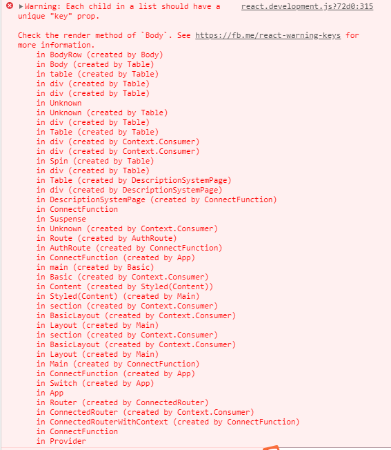
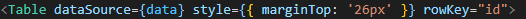

# 安恒信息

## 7月10

**工作内容**： 制作资产模块资产维护页面以及业务管理系统的主界面

 

## 7月13

**工作内容**： 制作业务管理系统详情页面和新增业务系统页面

 

**难点**：详情页面中部分信息要求有展开收起功能

 

**解决方法**：在S组件中设置一个全局变量，三个函数组件。一个全部变量用于表示当前是处于展开还是收起状态，A函数组件返回JSX代码为收起时的页面代码，B函数组件返回的JSX代码为展开时的页面代码。这两个函数组件的JSX代码中触发展开收起功能的按钮上绑定一个点击事件，点击时改变全局变量。

C函数用于根据全局变量的状态选择执行返回A还是B。

最后在S组件返回的JSX代码相应位置嵌入表达式执行C函数

**`ps`**：或者可以用三元表达式来根据变量选择返回哪段JSX代码，至于排版可以用Row,Col来解决

 

 

## 7月14

**工作内容**：制作业务管理系统导入功能相关页面，系统定级相关页面，系统删除对应页面

 

**难点**：在使用`antd`的modal组件时，关闭对话框，重新打开，之前所做的修改依旧存在。也就是说组件在关闭时没有销毁。在应用`antd`文档中modal的`destoryOnClose`属性后依旧无效。

 

**解决方法**：使用组件key值不一样会销毁组件重新生成新组件的特性。全局设置一个k变量，k值传给对应的对话框组件key属性，点击按钮时，触发的点击事件中赋给k一个新的随机值，也就是`Math.random(`)，这样的话，每次关闭对话框重新点击打开时，key属性值会变成一个新值，和之前不一样，对话框就会重新创建。

 

## 7月15

**问题**：当`useState`初始化传入了一个对象时，之后想要更改对象中某个属性的值时，其他属性会被覆盖。

 

**解决方法**：`useState`不像 class 中的 `this.setState`，更新 state 变量总是替换它而不是合并它。为了现有状态不被覆盖，在使用`setDate`更改指定值前，先使用…data展开

例：`setData`({

​          …data,

​          target: `newValue`

})

 

## 7月20

**工作内容**：制作工作台情报热点界面并对接接口

 

## 7月21

**工作内容**：调试之前业务管理系统和资产维护界面的接口

 

## 7月22

**工作内容**：制作不同类型资产的详情页，因为已有基础模板，相对轻松完成，接口方面由于后端正在调整，只写了相关代码。

 

**问题**：一直以来使用`antd`中的table组件时，页面上总会出现一个问题，警告信息说明组件缺少key，我曾讲tabel组件中每一个column都加上key属性，乃至于它们render函数中遍历出来的组件也加上key，仍然没有解决这个问题，因此这个问题普通存在于我的各个页面中。



**解决方法**：直接在tabel标签上加上rowKey属性就解决了，加上后哪怕将各个column中的key属性删除也无影响




**注意**：**当我们使用`useState`时尽可能给予初始化值**

比如说下面这种情况，data的值由接口返回的数据赋值，并且在之后的数据展示中直接通过{data.name}这种方式赋值，当接口返回的数据没有缺失时自然是正常显示页面的。

```javascript
    const [data, setData] = useState({});

    const params = {
        id: props.id,
    };
    const fetchDetail = () => {
        getDetail(params).then((res) => {
            if (res.code === 200) {
                setData({ ...res.data });
            }
        });
    };

...
<Descriptions.Item label="业务系统名称" style={{ paddingLeft: 122 }} span={2}>
    {data.name}
</Descriptions.Item>
...
```

但是假如接口返回的数据缺失了name字段怎么办？如此setData赋值后data依旧没有name属性，直接展示{data.name}很可能造成页面直接崩溃，一片白屏，而初始化值能很好避免这种情况

```react
    const [data, setData] = useState({
        projectId: 0,
        name: '',
        type: 0,
        description: '',
        scopeOfServices: 0,
        serviceObject: 0,
        coverageArea: 0,
        network: 0,
        systemInterconnected: 0,
        remark: '',
    });
```

当然，不是说无论何时都要初始化值，但是我们要有这个意识，某些时候要注意！

