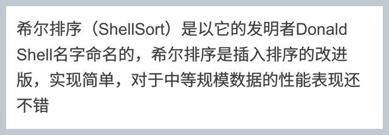
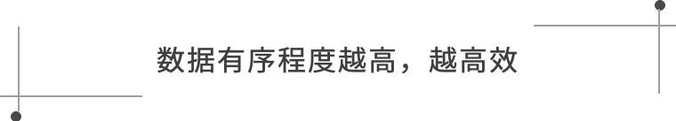
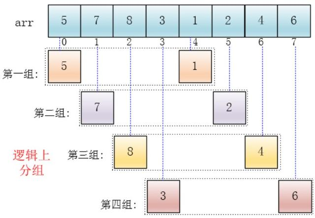
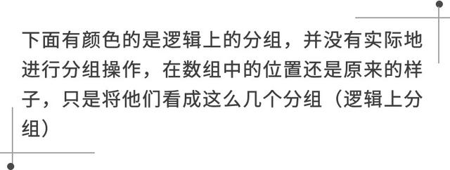
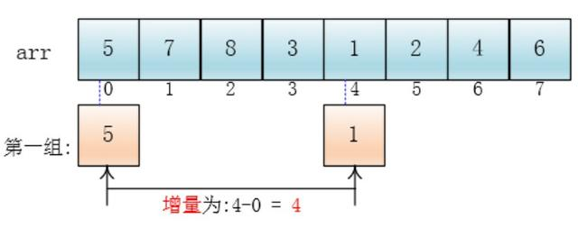
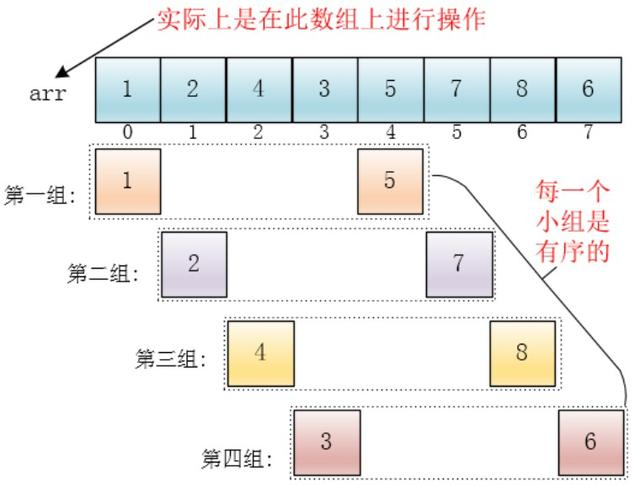
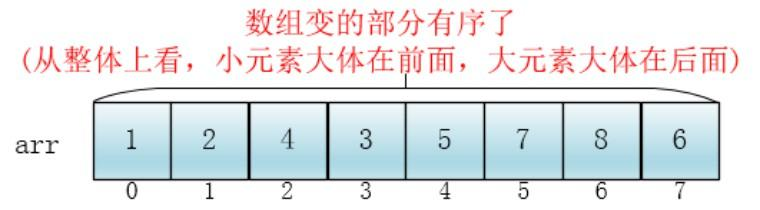
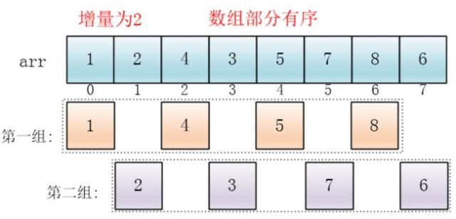
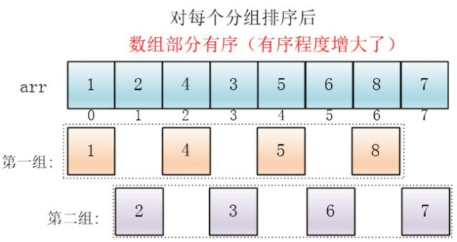
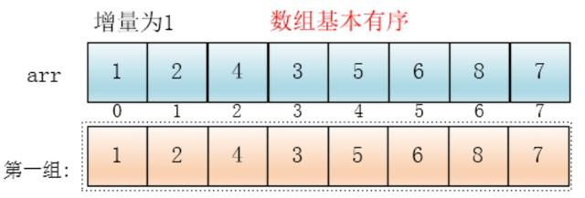

# 希尔排序

希尔排序(Shell Sort)是插入排序的一种，它是针对直接插入排序算法的改进。该方法又称缩小增量排序，因DL．Shell于1959年提出而得名。
希尔排序实质上是一种分组插入方法。它的基本思想是：对于n个待排序的数列，取一个小于n的整数gap(gap被称为步长)将待排序元素分成若干个组子序列，所有距离为gap的倍数的记录放在同一个组中；然后，对各组内的元素进行直接插入排序。 这一趟排序完成之后，每一个组的元素都是有序的。然后减小gap的值，并重复执行上述的分组和排序。重复这样的操作，当gap=1时，整个数列就是有序的。

可以看出，他是按下标相隔距离为4分的组，也就是说把下标相差4的分到一组，比如这个例子中a[0]与a[4]是一组、a[1]与a[5]是一组...，这里的差值（距离）被称为增量

每个分组进行插入排序后，各个分组就变成了有序的了（整体不一定有序）

此时，整个数组变的部分有序了（有序程度可能不是很高）

然后缩小增量为上个增量的一半:2，继续划分分组，此时，每个分组元素个数多了，但是，数组变的部分有序了，插入排序效率同样比高

同理对每个分组进行排序（插入排序），使其每个分组各自有序

最后设置增量为上一个增量的一半：1，则整个数组被分为一组，此时，整个数组已经接近有序了，插入排序效率高

同理，对这仅有的一组数据进行排序，排序完成
