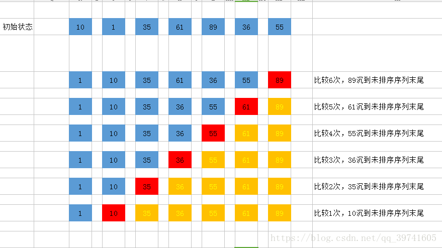

# 冒泡排序

0.如果遇到相等的值不进行交换，那这种排序方式是稳定的排序方式。

1.原理：比较两个相邻的元素，将值大的元素交换到右边

2.思路：依次比较相邻的两个数，将比较小的数放在前面，比较大的数放在后面。

　　　　(1)第一次比较：首先比较第一和第二个数，将小数放在前面，将大数放在后面。

　　　　(2)比较第2和第3个数，将小数 放在前面，大数放在后面。

　　　　......

　　　　(3)如此继续，知道比较到最后的两个数，将小数放在前面，大数放在后面，重复步骤，直至全部排序完成

　　　　(4)在上面一趟比较完成后，最后一个数一定是数组中最大的一个数，所以在比较第二趟的时候，最后一个数是不参加比较的。

　　　　(5)在第二趟比较完成后，倒数第二个数也一定是数组中倒数第二大数，所以在第三趟的比较中，最后两个数是不参与比较的。

　　　　(6)依次类推，每一趟比较次数减少依次

3.举例：

　　　　(1)要排序数组:[10,1,35,61,89,36,55]

4.算法分析：

　　　　(1)由此可见：N个数字要排序完成，总共进行N-1趟排序，每i趟的排序次数为(N-i)次，所以可以用双重循环语句，外层控制循环多少趟，内层控制每一趟的循环次数

　　　　(2)冒泡排序的优点：每进行一趟排序，就会少比较一次，因为每进行一趟排序都会找出一个较大值。如上例：第一趟比较之后，排在最后的一个数一定是最大的一个数，第二趟排序的时候，只需要比较除了最后一个数以外的其他的数，同样也能找出一个最大的数排在参与第二趟比较的数后面，第三趟比较的时候，只需要比较除了最后两个数以外的其他的数，以此类推……也就是说，没进行一趟比较，每一趟少比较一次，一定程度上减少了算法的量。

　　　　(3)时间复杂度

　　　　1.如果我们的数据正序，只需要走一趟即可完成排序。所需的比较次数C和记录移动次数M均达到最小值，即：Cmin=n-1;Mmin=0;所以，冒泡排序最好的时间复杂度为O(n)。

　　　　2.如果很不幸我们的数据是反序的，则需要进行n-1趟排序。每趟排序要进行n-i次比较(1≤i≤n-1)，且每次比较都必须移动记录三次来达到交换记录位置。在这种情况下，比较和移动次数均达到最大值
