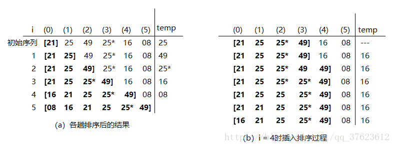

# 直接插入排序

1. 插入排序概念
插入排序的基本方法是：每一步将一个待排序的元素，按其排序码的大小，插入到前面已经排好序的一组元素的适当位置上去，直到元素全部插入为止。
可以选择不同的方法在已经排好序数据表中寻找插入位置。根据查找方法不同，有多种插入排序方法，下面要介绍的是直接插入排序。

2. 直接插入排序基本思想
      直接插入插排的基本思想是：当插入第i(i >= 1)时，前面的V[0]，V[1]，……，V[i-1]已经排好序。这时，用V[I]的排序码与V[i-1]，V[i-2]，…的排序码顺序进行比较，找到插入位置即将V[i]插入，原来位置上的元素向后顺移。

      在图a中给出了直接插入排序的过程。设在元素表中有n = 6个元素，为了使描述书简介直观，在图中只画出各元素的排序码。其中有两个排序码相同，前一个直接写为25，后一个标记为25*。假定其中V[0]，…，V[i-1]已经是一组有序的元素，V[i]，V[i+1]，……，V[n-1]是带插入的元素。排序过程从i = 1起，每执行完一趟之后i增加1，把第i各元素插入到前面有序的元素序列中去，使插入后的元素序列V[0]，V[1]，……，V[i-1]仍保持有序。



图b是一趟排序过程（i = 4）的示例。此时，从V[0]到V[3]已经排好序，算法先比较V[4]与V[3]，因为V[4]小于V[3]，因此需要到V[3]到V[0]中寻找插入位置，为此需要将V[4]放到一个临时变量temp中暂存，放置前面的元素后移时把它覆盖掉；然后从后向前依次比较寻找插入的位置。设循环变量为j，如果V[j]的排序码大于temp的排序码，就将V[j]后移，直到某一个V[j]小于或等于temp的排序码或元素的序列比较完为止，最后把暂存于temp中的原来的元素V[i]反填到第j个位置的后一个位置，一趟排序就结束了。下面给出算法的源代码:

```java
//直接插入排序法
public static void insertSort(int[] list) {
    int temp;
    int j;
    for (int i=0; i<list.length; i++) {
        temp = list[i];

        for (j=i-1; j>=0 && list[j]>temp; j--) {
            list[j+1] = list[j];
        }
        //注意：temp赋值给j+1，不是j。for循环特性
        list[j+1] = temp;
    }
}
```
